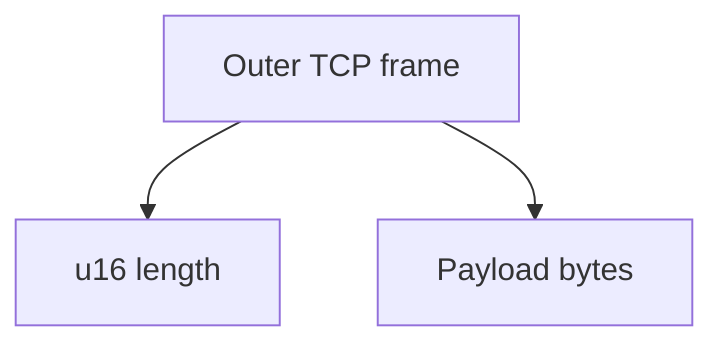
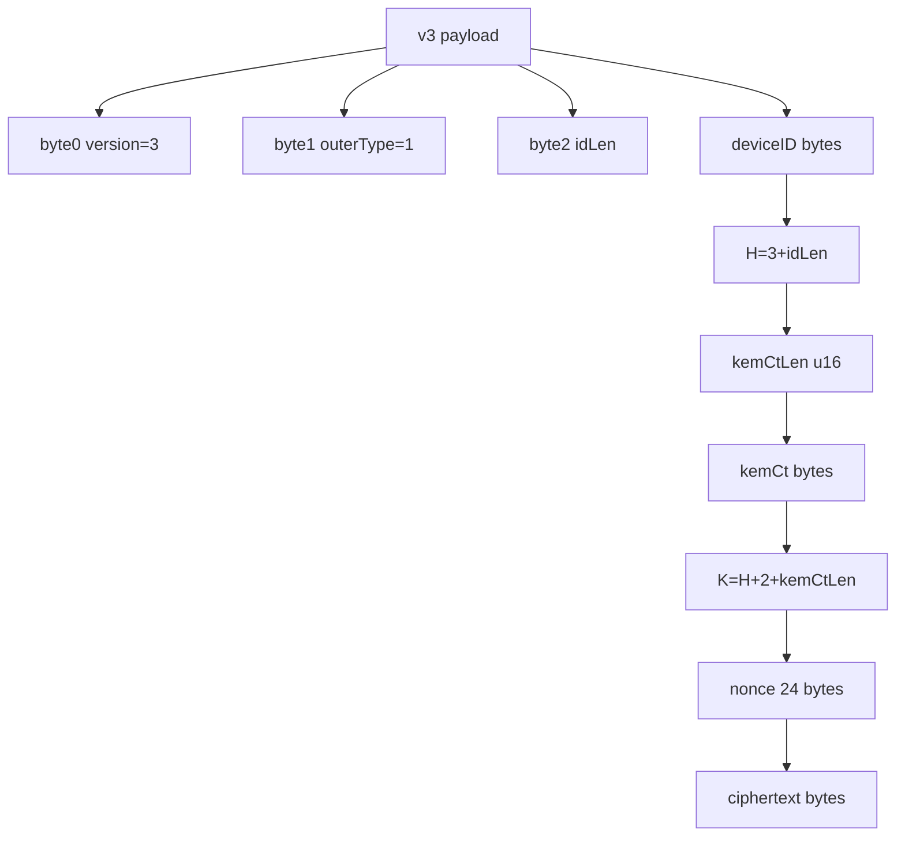
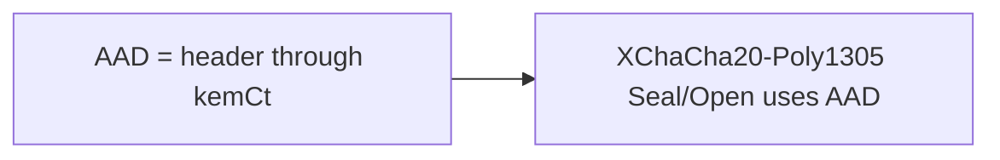
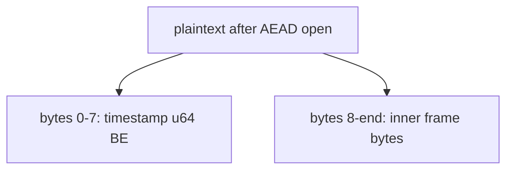
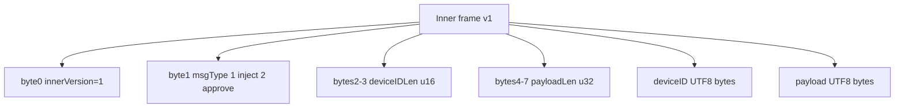
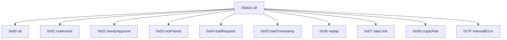
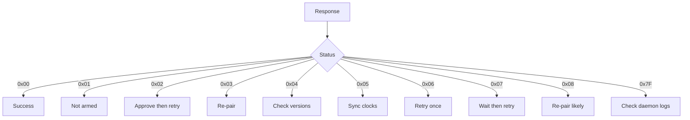
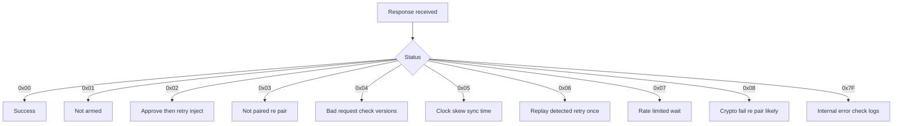
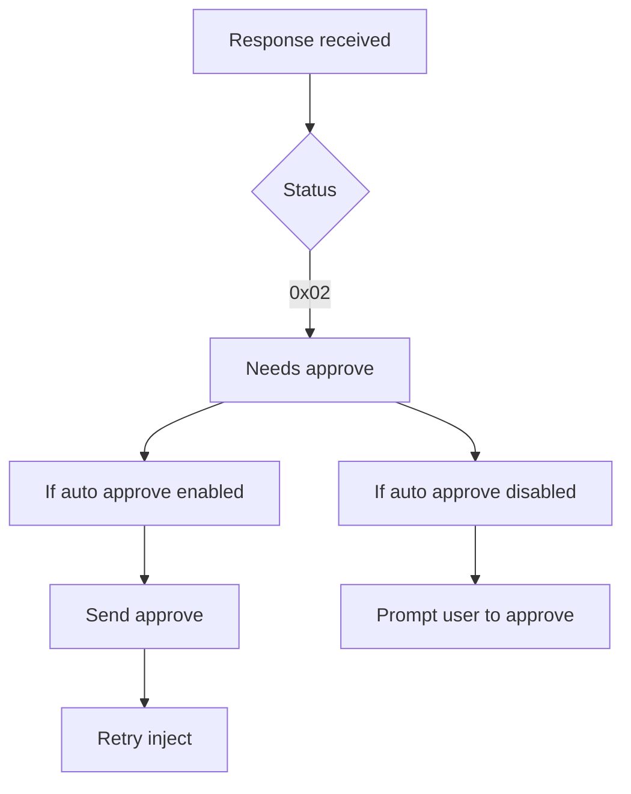

# NovaKey-Daemon Protocol v3 (ML-KEM-768 + XChaCha20-Poly1305)

**Status:** implemented  
**Scope:** Typing daemon (Linux / macOS / Windows) ⇄ clients (`nvclient`, future phone app)

This describes how clients send authenticated “inject this secret” requests to NovaKey-Daemon over TCP using:

* **ML-KEM-768** for post-quantum key establishment
* **HKDF-SHA-256** for per-message session key derivation
* **XChaCha20-Poly1305** for AEAD encryption/authentication
* A per-device **static secret** (PSK) as the HKDF salt / device binding

Protocol frames with `version != 3` are rejected.

---

## 1. Transport

* **Protocol:** TCP
* **Default port:** `60768`
* **Listen address:** `listen_addr` from `server_config.yaml` (preferred) or `server_config.json` (fallback)

Each request is a single TCP connection:

1. Client connects.
2. Client sends one framed message.
3. Server processes it and closes the connection.

No multiplexing or connection reuse.

---

## 2. Key Material & Pairing

NovaKey-Daemon v3 uses:

1. **Server ML-KEM-768 keypair** (`server_keys.json`)
2. **Per-device PSK** (`devices.json`, 32 bytes hex)
3. **Per-message KEM shared secret** (derived for each request)

### 2.1 Server KEM keys (`server_keys.json`)

On first startup, the daemon creates `server_keys.json` if missing.

Example:

```json
{
  "kyber768_public": "<base64 ML-KEM-768 public>",
  "kyber768_secret": "<base64 ML-KEM-768 secret>"
}
````

* `kyber768_public` is shared with clients during pairing.
* `kyber768_secret` stays on the host and is only used to decapsulate.

### 2.2 Device keys (`devices.json`)

`devices.json` contains per-device PSKs:

```json
{
  "devices": [
    {
      "id": "phone",
      "key_hex": "32-bytes-hex..."
    }
  ]
}
```

* `key_hex` MUST decode to 32 bytes.
* Generated/managed by `nvpair`.

### 2.3 Pairing blob (QR / JSON)

`nvpair` emits a pairing blob that clients store:

```json
{
  "v": 1,
  "device_id": "phone",
  "device_key_hex": "32-bytes-hex...",
  "server_addr": "192.168.1.10:60768",
  "server_kyber768_pub": "<base64 pubkey>"
}
```

Treat this pairing blob as a secret.

---

## 3. Outer framing (TCP)

At the TCP level:

```text
[ u16 length ][ length bytes payload ]
```

* `length`: unsigned 16-bit big-endian
* `payload`: a single v3 encrypted message

---

## 4. Outer v3 payload layout (current)

The v3 payload bytes are:

```text
[0]                = version (u8, must be 3)
[1]                = outer msgType (u8, fixed to 1 in v3)
[2]                = idLen (u8)
[3 : 3+idLen]      = deviceID (bytes)

H = 3 + idLen
[H : H+2]          = kemCtLen (u16 big-endian)
[H+2 : ...]        = kemCt (kemCtLen bytes)

K = H + 2 + kemCtLen
[K : K+24]         = nonce (24 bytes, XChaCha20-Poly1305)
[K+24 : end]       = ciphertext (AEAD output)
```

Notes:

* `kemCtLen` is included for robustness/future-proofing.
* With `filippo.io/mlkem768` today, the ciphertext is **1088 bytes**.
* The daemon rejects frames where `outer msgType != 1`.
  “Approve vs Inject” is represented only in the **inner** message frame.

### 4.1 Associated Data (AAD)

NovaKey authenticates (binds) the entire header **through the KEM ciphertext** as AAD:

```text
AAD = payload[0 : K]
    = version || outerMsgType || idLen || deviceID || kemCtLen || kemCt
```

This prevents tampering with version/device routing fields and the KEM ciphertext bytes.

---

## 5. Plaintext layout inside AEAD (current)

After AEAD decryption:

```text
[0..7]   = timestamp (uint64 big-endian unix seconds)
[8..end] = inner message frame bytes
```

The **inner message frame** is a typed frame (v1) that carries “approve vs inject” explicitly.

---

## 6. Inner message frame (typed) format (v1)

Inner frame bytes:

```text
[0]   = innerVersion (u8) = 1
[1]   = innerMsgType (u8) = 1 inject, 2 approve
[2:4] = deviceIDLen (u16, big endian)
[4:8] = payloadLen  (u32, big endian)
[..]  = deviceID bytes (UTF-8)
[..]  = payload bytes  (UTF-8)
```

Rules:

* inner `deviceID` MUST match the outer `deviceID` (server rejects mismatch)
* `innerMsgType=1` (Inject): payload bytes are the secret string (UTF-8)
* `innerMsgType=2` (Approve): payload may be empty (ignored by server)

---

## 7. Crypto & key schedule

### 7.1 Algorithms

* **KEM:** ML-KEM-768
* **KDF:** HKDF-SHA-256
* **AEAD:** XChaCha20-Poly1305 (24-byte nonce)

### 7.2 Per-message key derivation

For each request:

1. Client encapsulates to server pubkey:

```text
kemCt, kemShared = MLKEM768_Encapsulate(serverPub)
```

2. Client derives AEAD key using HKDF:

```text
IKM  = kemShared
salt = deviceKey (32 bytes from device_key_hex)
info = "NovaKey v3 AEAD key"
K    = HKDF-SHA256(IKM, salt, info, outLen=32)
```

3. AEAD encrypts plaintext:

```text
nonce      = random 24 bytes
ciphertext = XChaCha20-Poly1305_Seal(K, nonce, plaintext, AAD)
```

4. Payload is assembled:

```text
payload = header_fields || kemCtLen || kemCt || nonce || ciphertext
```

Server reverses the process:

* Parse header + kemCtLen + kemCt
* `kemShared = MLKEM768_Decapsulate(serverSecret, kemCt)`
* HKDF derive the same `K`
* AEAD open with the same AAD
* Parse timestamp + inner frame bytes
* Decode inner frame and enforce policies

---

## 8. Server-side validation

After decrypting:

### 8.1 Timestamp freshness

Server rejects messages if:

* timestamp is too far in the future (clock skew window)
* message is too old (max message age)

### 8.2 Replay protection

Server maintains an in-memory cache keyed by `(deviceID, nonce)` for a TTL window.
Replays within the TTL are rejected.

### 8.3 Per-device rate limiting

Server enforces per-device accepted message limits using `max_requests_per_min`.

### 8.4 Arming & two-man policies (application-level)

These are **server policies**, not protocol changes:

* **Arming gate:** blocks injection unless locally armed.
* **Two-man mode:** requires a recent approve (inner msgType=2) from the same device before injection.

---

## 9. Injection behavior (summary)

Once all checks and policies pass, NovaKey calls:

```go
InjectPasswordToFocusedControl(password)
```

Platform notes:

* **Linux**

  * X11/XWayland: keystroke injection can work
  * Wayland native: focused app detection/typing may be limited (clipboard fallback may be used)
* **macOS**

  * Uses Accessibility / automation paths
* **Windows**

  * Uses safe control messaging where possible, otherwise synthetic typing fallback

---

## 10. Files involved (reference)

* `cmd/novakey/crypto.go` — framing parse + KEM/HKDF/AEAD + replay/rate/freshness + inner frame decode
* `cmd/novakey/message_frame.go` — inner typed message frame format
* `cmd/novakey/keys.go` — server key generation/loading
* `cmd/novakey/*_main.go` — TCP listener and dispatch
* `cmd/nvclient/` — reference client implementation
* `cmd/nvpair/` — pairing + device key management

> **NOTE:** Device IDs are sent in plaintext for routing/logging. Do not use sensitive identifiers.


## Packet Architectural Diagrams

### Outer TCP Frame



### v3 Payload Layout



### AAD Coverage



### Plaintext Inside AEAD



### Inner Frame v1 Layout



### Code → meaning



### Client handling decision tree



### Practical Client Handling





---
