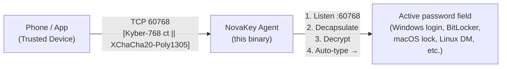

# 🔐 NovaKey by OsbornePro

**What is NovaKey?**  
*NovaKey is a lightweight, cross‑platform Go agent that turns your computer into a secure, quantum‑resistant password‑delivery endpoint.*

**Why would I need this?**  
*Even with a password manager you still need a master password to unlock the vault. That master password is often the weakest link—either memorised or stored insecurely. NovaKey eliminates that risk entirely:*
* Your real master password lives only on your phone.
* You never type it manually.
* Delivery uses post‑quantum cryptography.
* It works even when the computer is locked.

When you need to log in—whether at the Windows login screen, BitLocker PIN, macOS lock screen, Linux display manager, or any password field—you press a button in the companion app. The app encrypts the secret with Kyber‑768 + XChaCha20‑Poly1305, sends it over TCP port 60768, and NovaKey decrypts and auto‑types it into the active field (including lock screens).  

> **Key point:** No master password ever touches the keyboard, and no plaintext traverses the network.

---

## Table of Contents

- [Overview](#overview)
- [Features](#features)
- [Crypto Stack](#crypto-stack)
- [Architecture Diagram](#architecture-diagram)
- [Auto-Type Support Matrix](#auto-type-support-matrix)
- [Roadmap](#roadmap)
- [Security Notes](#security-notes)
- [Build from Source](#build-from-source)
- [How to Install](#how-to-install)
- [Logging](#logging)
- [Contributing](#contributing)
- [License](#license)
- [Contact & Support](#contact--support)

---

## Overview
The NovaKey service runs on a workstation (*Windows, macOS, or Linux*). It creates a TCP listener on `<your‑pc‑ip>:60768`. The companion mobile app connects to this listener, sends an encrypted payload, and NovaKey:

1. **Decapsulates** the Kyber‑768 ciphertext to obtain a 32‑byte session key.
2. **Decrypts** the payload with XChaCha20‑Poly1305.
3. **Auto‑types** the resulting password (or MFA code) into the currently focused window.
All cryptographic operations are performed in constant‑time, using the audited Cloudflare circl library.

---

## Features
| ✅ | Feature |
|---|---------|
| ✅ | **True post‑quantum security** – Kyber‑768 + XChaCha20‑Poly1305 |
| ✅ | **Auto‑type into any focused field** – including lock screens |
| ✅ | **Cross‑platform** – Windows, macOS (universal), Linux (amd64 + arm64) |
| ✅ | **Single static binary** – no CGO, no external dependencies |
| ✅ | **Zero‑configuration** – just run it |
| ✅ | **Works over Wi‑Fi, USB tethering, VPN, Tailscale, etc.** |
| ✅ | **No internet access required** |
| ✅ | **Open‑source agent** – build and audit everything |

---

## Crypto Stack

* **Key Exchange**: Kyber‑768 (*NIST‑selected KEM*)
* **Symmetric Encryption**: XChaCha20‑Poly1305 (*libsodium standard*)
* **Key Management**: Ephemeral keys generated at startup; private key lives only in memory and is never persisted.

---

## Architecture Diagram



---

## Auto Type Support Matrix

| OS                     | Lock Screen | Login Screen | BitLocker | FileVault | SDDM/GDM/LightDM |
|------------------------|------------|--------------|-----------|-----------|-------------------|
| **Windows 10/11**      | ✅ | ✅ | ✅ | N/A | N/A |
| **macOS 13+**          | ✅ | ✅ | N/A | ✅ | N/A |
| **Linux (xdotool)**    | ✅ | ✅ | N/A | N/A | ✅* |

*Linux requires `xdotool` (`sudo apt install xdotool` or the equivalent for your distro). If `xdotool` is missing, NovaKey prints a warning at startup and auto‑type will not function.*

---

## Roadmap

Features that are planned for the future:

| Feature                            | Status |
|------------------------------------|--------|
| Companion mobile app (iOS/Android) | In development |
| Auto‑start as system service       | Next |
| One‑time‑use unlock tokens         | Planned |
| BLE fallback (optional)            | Future |
| GUI tray icon & config UI          | Planned |
| TOTP / MFA code support            | Planned |
| Add option to approve before auto-typing | Planned |

---

## Security Notes

### Security Design Principles

- **Local-first by design** – no cloud storage, no relays, no third-party dependencies at runtime  
- **Cryptographically authenticated input** – keystrokes are only accepted after successful cryptographic verification  
- **Minimized trust and privilege** – the service operates with the least permissions required by the host OS  
- **Defense-in-depth** – multiple independent protections against compromise, misuse, and abuse  

### Cryptography & Secure Transport

- **Ephemeral post-quantum key material.**  
  On startup, each service instance generates an in-memory Kyber768 private key which is never persisted to disk. Restarting the service automatically rotates all cryptographic material.

- **Post-quantum authenticated encryption.**  
  NovaKey uses Cloudflare’s official `circl` Kyber768 KEM (constant-time) to establish a shared secret, followed by XChaCha20-Poly1305 authenticated encryption to ensure payload confidentiality and integrity.

- **No plaintext acceptance.**  
  All inbound messages must pass cryptographic verification before any data is processed. Plaintext inputs are never accepted.

### Replay & Abuse Prevention

- **Replay-attack protection.**  
  Each encrypted payload includes a UNIX timestamp and a cryptographically secure random nonce. The service maintains a bounded replay cache and rejects duplicate or stale messages outside a strict validity window.

- **Denial-of-Service (DoS) protection.**  
  Incoming connections are rate-limited per IPv4 address prior to performing expensive cryptographic operations. Strict payload size limits prevent memory exhaustion and computational abuse.

- **IPv4-only listener with explicit validation.**  
  The service listens exclusively on IPv4 and performs full validation and authentication on every connection.

### Secret Handling & Memory Safety

- **No secrets stored on disk.**  
  Passwords, session keys, and decrypted payloads exist only in memory during active processing.

- **No secret leakage via logs or process metadata.**  
  Decrypted secrets, password contents, and derived metadata are never logged. Passwords are never passed via command-line arguments, preventing leakage through system process inspection tools.

- **Byte-buffer based secret handling.**  
  Sensitive data is handled as mutable byte slices rather than immutable language-level strings, reducing unintended memory persistence.

- **Best-effort memory wiping.**  
  Shared secrets, decrypted payloads, and password buffers are explicitly overwritten immediately after use to minimize their lifetime in memory.

### Keystroke Injection Security

- **Isolated secure typing abstraction.**  
  All OS-specific keystroke injection is encapsulated behind a `SecureType` interface. This prevents cryptographic or networking logic from interacting directly with platform APIs.

- **Forward-compatible with OS secure input APIs.**  
  The abstraction layer allows future migration to native secure input mechanisms (where available) without redesigning transport or cryptography.

### Least-Privilege Execution Environment

- **Dedicated service account.**  
  The NovaKey service runs under a non-interactive, dedicated system account with no login shell and minimal filesystem access.

- **Linux sandboxing and hardening.**  
  When installed on Linux, NovaKey runs under a hardened systemd service configuration that disables privilege escalation, restricts filesystem access, and limits writable paths to explicitly required directories.

- **No elevated privileges during runtime.**  
  Administrative privileges are required only during installation; normal operation does not require root or administrator access.

### Build & Dependency Integrity

- **Single-package build model.**  
  Core functionality is compiled into a single Go package, ensuring consistent application of security helpers such as memory zeroing and payload validation.

- **Auditable, well-maintained dependencies.**  
  All cryptographic operations rely exclusively on widely used, peer-reviewed libraries maintained by reputable organizations.

### Network Trust Model

- **User-controlled trust boundary.**  
  NovaKey is designed to operate on a trusted local network or user-managed VPN such as Tailscale or Zerotier. No external servers or cloud infrastructure are required or contacted.

## Threat Model Appendix

### In-Scope Threats

| Threat | Mitigation |
|------|----------|
| Network eavesdropping | Post-quantum authenticated encryption |
| Replay attacks | Timestamp + nonce validation with replay cache |
| Packet injection | Mandatory cryptographic verification |
| Memory scraping | Byte-buffer handling and immediate wiping |
| Privilege escalation | Dedicated service accounts and OS sandboxing |
| DoS via expensive crypto | Rate limiting before decapsulation |
| Process inspection | No secrets in argv or logs |

### Out-of-Scope / Assumed Trust

- Compromised host operating system
- Malicious kernel-level malware
- User-approved accessibility misuse on macOS
- Physical access to an unlocked system
- Malicious applications with equivalent keystroke injection privileges

### Security Posture Summary

NovaKey assumes a **zero-trust network** and **honest-but-curious local environment** while defending aggressively against remote attacks, replay abuse, cryptographic compromise, and accidental leakage of sensitive data. The system favors transparency, simplicity, and minimal privilege over opaque or cloud-dependent approaches.

### Disclosure & Review

NovaKey’s security architecture is designed to be auditable and reviewable. All cryptographic choices, memory handling practices, and runtime permissions are explicitly documented and enforced at build and install time.

---

## Build from Source

**PowerShell build commands**
```powershell
# Download the source archive
Invoke-WebRequest -Uri "https://github.com/OsbornePro/NovaKey/archive/refs/heads/main.zip" -OutFile "$env:TEMP\NovaKey-main.zip"

# Extract
Expand-Archive -Path "$env:TEMP\NovaKey-main.zip" -DestinationPath "$env:ProgramFiles" -Force

# Rename for simplicity
Rename-Item -Path "$env:ProgramFiles\NovaKey-main" -NewName "NovaKey"

# Build
Set-Location -Path "$env:ProgramFiles\NovaKey"
.\Build-Scripts\build.ps1 -Clean -Target windows -FileName NovaKey.exe
```

**Linux / OpenBSD / Unix (Bash) build commands**
```bash
# Clone the repo
git clone https://github.com/OsbournePro/NovaKey.git
cd NovaKey

# Build for Linux (or macOS – the same script detects GOOS)
./Build-Scripts/build.sh -t linux   # replace "linux" with "darwin" for macOS
```

---

## How to Install

NovaKey is distributed as a **precompiled system service**.
You do **not** need to compile anything from source.

> **Administrator privileges are required during installation only.**
> After installation, NovaKey runs as a restricted system service.

## Windows Installation

NovaKey for Windows is distributed as a **precompiled Windows service**.
No build tools or source compilation are required.

> **Administrator privileges are required during installation only.**
> After installation, NovaKey runs as a restricted Windows service using a virtual service account.

### Requirements

* Windows 10 or newer
* PowerShell 5.1 or newer
* Administrator access

### Install

1. Download and extract the Windows archive:

```powershell
Expand-Archive -Path NovaKey-Windows.zip
Set-Location -Path NovaKey-Windows
```

2. Run the installer **as Administrator**:

* Right-click `install-windows.ps1`
* Select **Run with PowerShell**

If script execution is restricted, you may temporarily allow it:

```powershell
Set-ExecutionPolicy -Scope Process -ExecutionPolicy Bypass
.\install-windows.ps1
```

### What the Installer Does

The Windows installer performs the following actions:

* Installs NovaKey to `C:\Program Files\NovaKey`
* Registers a Windows service that starts automatically at boot
* Runs the service under a dedicated virtual service account (`NT SERVICE\NovaKey`)
* Applies restricted filesystem permissions
* Adds a Windows Firewall rule for the NovaKey listening port
* Starts the service immediately after installation

### Verify Installation

Check that the service is running:

```powershell
Get-Service NovaKey
```

View recent service events:

```powershell
Get-WinEvent -LogName Application | Where-Object { $_.ProviderName -like "*NovaKey*" }
```

### Logs

Runtime logs (if enabled) are stored in:

```
C:\Program Files\NovaKey\logs\
```

### Updating

To update NovaKey:

1. Stop the running service:

```powershell
Stop-Service -Name NovaKey
```

2. Replace `novakey-service.exe` with the new version
3. Re-run the installer script:

```powershell
.\install-windows.ps1
```

### Uninstalling

An automated uninstaller is not yet included.  
To remove NovaKey manually:

```powershell
Stop-Service -Name NovaKey -Force
sc.exe delete NovaKey
Remove-Item -Recurse -Force -Path "C:\Program Files\NovaKey"
Remove-NetFirewallRule -DisplayName "NovaKey TCP Listener"
```

If installation fails, ensure that you are running PowerShell as Administrator and that no existing NovaKey service is already active.

### Linux Installation (systemd-based distributions)

#### Requirements

* systemd-based Linux distribution
* `sudo` access
* `xdotool` installed (required for auto-typing)

#### Install

Run the following commands:

```bash
tar -xzf novakey-linux.tar.gz
cd novakey-linux
sudo ./install-linux.sh
```

The installer will:

* Create a dedicated `novakey` system user with no login shell
* Install the service binary to `/usr/local/bin`
* Create configuration, data, and log directories with restricted permissions
* Register and start the NovaKey service at boot

#### Verify Installation

```bash
systemctl status novakey
```

#### View Logs

```bash
journalctl -u novakey
```

> **Note:** The service listens on IPv4 only.
> Make sure your firewall allows inbound connections on the configured port if required.

---

### macOS Installation

#### Requirements

* macOS 12 or newer
* `sudo` access
* User approval for Accessibility and Input Monitoring permissions

#### Install

```bash
tar -xzf novakey-macos.tar.gz
cd novakey-macos
sudo ./install-macos.sh
```

The installer will:

* Install the NovaKey service binary to `/usr/local/bin`
* Create required directories under `/Library/Application Support/NovaKey`
* Register and start a persistent LaunchDaemon at system boot

---

#### Required Permissions (macOS)

macOS requires user approval for applications that inject keystrokes.

After installation, grant NovaKey permission in:

* **System Settings → Privacy & Security → Accessibility**
* **System Settings → Privacy & Security → Input Monitoring**

After granting permissions, restart the service:

```bash
sudo launchctl unload /Library/LaunchDaemons/com.osbornepro.novakey.plist
sudo launchctl load /Library/LaunchDaemons/com.osbornepro.novakey.plist
```

---

### Updating

To update NovaKey, stop the service and re-run the installer.

**Linux**

```bash
sudo systemctl stop novakey
sudo ./install-linux.sh
```

**macOS**

```bash
sudo ./install-macos.sh
```

---

### Uninstalling

Uninstall scripts are not yet included.
NovaKey can be removed manually as follows.

#### Linux

```bash
sudo systemctl disable --now novakey
sudo rm /etc/systemd/system/novakey.service
sudo rm /usr/local/bin/novakey-service
sudo rm -rf /etc/novakey /var/lib/novakey /var/log/novakey
sudo userdel novakey
```

#### macOS

```bash
sudo launchctl unload /Library/LaunchDaemons/com.osbornepro.novakey.plist
sudo rm /Library/LaunchDaemons/com.osbornepro.novakey.plist
sudo rm /usr/local/bin/novakey-service
sudo rm -rf "/Library/Application Support/NovaKey"
```

If installation fails, verify that you downloaded the correct archive for your operating system and that you have administrator privileges.

---

## Logging

| OS      | Log location |
|---------|--------------|
| **Windows** | Event Viewer → Applications and Services Logs → NovaKey |
| **macOS**   | `/var/log/novakey.out` and `/var/log/novakey.err` (defined in the launchd plist) |
| **Linux**   | `journalctl -u novakey.service` |

*Tip (Linux):* view logs in real‑time  

```bash
journalctl -fu novakey.service
```

---  

## Contributing
We welcome contributions! Please follow these steps:

1. Fork the repository and create a feature branch (`git checkout -b feat/your‑feature`).
2. Write tests – the project uses Go’s standard testing package. Run `go test ./...` locally.**
3. Run linters – we use `golangci-lint`. Install with `go install github.com/golangci/golangci-lint/cmd/golangci-lint@latest` and run `golangci-lint run`.
4. Update documentation – if you add a new flag or change behaviour, update the README.md and/or the EULA.md.
5. Submit a Pull Request – link any related issue, and ensure CI passes.

> **NOTE**: All contributions are accepted under the same commercial licence (*the contributor assigns the rights to OsbornePro, LLC.*). By submitting a PR you agree to this arrangement.*

---

## License

NovaKey is **proprietary commercial software**. See `EULA.md` for the full terms.
The source code in this repository is provided **as‑is** solely for the purpose of building the binary; redistribution of the source or compiled binaries is prohibited without a separate written licence from OsbornePro LLC.

---

## Contact & Support

- **Product website / purchase:** https://novakey.app
- **Technical support:** support@novakey.app
- **PGP key (for encrypted email):** https://downloads.osbornepro.com/publickey.asc
- **Security disclosures:** Review the policy **[HERE](https://github.com/OsbornePro/NovaKey/blob/main/SECURITY.md)** (do **not** open vulnerabilities via GitHub Issues).
- **GitHub issues:** Use the Issues tab for bugs, feature requests, or installation help. Please do not submit security findings as "*Issues*".
