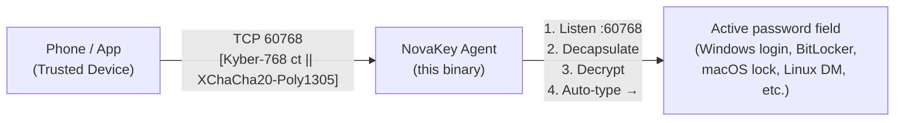

# 🔐 NovaKey by OsbornePro

**What is NovaKey?**  
*NovaKey is a lightweight, cross‑platform Go agent that turns your computer into a secure, quantum‑resistant password‑delivery endpoint.*

**Why would I need this?**  
*Even with a password manager you still need a master password to unlock the vault. That master password is often the weakest link—either memorised or stored insecurely. NovaKey eliminates that risk entirely:*
* Your real master password lives only on your phone.
* You never type it manually.
* Delivery uses post‑quantum cryptography.
* It works even when the computer is locked.

When you need to log in—whether at the Windows login screen, BitLocker PIN, macOS lock screen, Linux display manager, or any password field—you press a button in the companion app. The app encrypts the secret with Kyber‑768 + XChaCha20‑Poly1305, sends it over TCP port 60768, and NovaKey decrypts and auto‑types it into the active field (including lock screens).  

> **Key point:** No master password ever touches the keyboard, and no plaintext traverses the network.

---

## Table of Contents

- [Overview](#overview)
- [Features](#features)
- [Crypto Stack](#crypto-stack)
- [Architecture Diagram](#architecture-diagram)
- [Auto-Type Support Matrix](#auto-type-support-matrix)
- [Roadmap](#roadmap)
- [Security Notes](#security-notes)
- [Build from Source](#build-from-source)
- [Logging](#logging)
- [Contributing](#contributing)
- [License](#license)
- [Contact & Support](#contact--support)

---

## Overview
The NovaKey service runs on a workstation (*Windows, macOS, or Linux*). It creates a TCP listener on `<your‑pc‑ip>:60768`. The companion mobile app connects to this listener, sends an encrypted payload, and NovaKey:

1. **Decapsulates** the Kyber‑768 ciphertext to obtain a 32‑byte session key.
2. **Decrypts** the payload with XChaCha20‑Poly1305.
3. **Auto‑types** the resulting password (or MFA code) into the currently focused window.
All cryptographic operations are performed in constant‑time, using the audited Cloudflare circl library.

---

## Features
| ✅ | Feature |
|---|---------|
| ✅ | **True post‑quantum security** – Kyber‑768 + XChaCha20‑Poly1305 |
| ✅ | **Auto‑type into any focused field** – including lock screens |
| ✅ | **Cross‑platform** – Windows, macOS (universal), Linux (amd64 + arm64) |
| ✅ | **Single static binary** – no CGO, no external dependencies |
| ✅ | **Zero‑configuration** – just run it |
| ✅ | **Works over Wi‑Fi, USB tethering, VPN, Tailscale, etc.** |
| ✅ | **No internet access required** |
| ✅ | **Open‑source agent** – build and audit everything |

---

## Crypto Stack

* **Key Exchange**: Kyber‑768 (*NIST‑selected KEM*)
* **Symmetric Encryption**: XChaCha20‑Poly1305 (*libsodium standard*)
* **Key Management**: Ephemeral keys generated at startup; private key lives only in memory and is never persisted.

---

## Architecture Diagram



---

## Auto Type Support Matrix

| OS                     | Lock Screen | Login Screen | BitLocker | FileVault | SDDM/GDM/LightDM |
|------------------------|------------|--------------|-----------|-----------|-------------------|
| **Windows 10/11**      | ✅ | ✅ | ✅ | N/A | N/A |
| **macOS 13+**          | ✅ | ✅ | N/A | ✅ | N/A |
| **Linux (xdotool)**    | ✅ | ✅ | N/A | N/A | ✅* |

*Linux requires `xdotool` (`sudo apt install xdotool` or the equivalent for your distro). If `xdotool` is missing, NovaKey prints a warning at startup and auto‑type will not function.*

---

## Roadmap

Features that are planned for the future:

| Feature                            | Status |
|------------------------------------|--------|
| Companion mobile app (iOS/Android) | In development |
| Auto‑start as system service       | Next |
| One‑time‑use unlock tokens         | Planned |
| BLE fallback (optional)            | Future |
| GUI tray icon & config UI          | Planned |
| TOTP / MFA code support            | Planned |

---

## Security Notes

* Private key is generated in memory on startup and never written to disk.
* No logs contain decrypted secrets. Only password length is logged when auto-typing.
* All crypto uses the official Cloudflare circl v1.6+ library (*constant‑time*) and XChaCha20‑Poly1305 authenticated encryption.
* Payloads are validated to prevent memory exhaustion (*maximum ciphertext and plaintext sizes enforced*).
* Sensitive buffers (*shared secrets, decrypted payloads, passwords*) are zeroed in memory immediately after use.
* Keystrokes are typed via a SecureType abstraction; this allows future use of OS-level secure input APIs instead of raw key events.
* You control the network – use Tailscale, Zerotier, or a local Wi‑Fi subnet.
* All files are compiled within a single package to ensure security helpers (*like memory zeroing*) are applied consistently.

---

## Build from Source

**PowerShell build commands**
```powershell
# Download the source archive
Invoke-WebRequest -Uri "https://github.com/OsbornePro/NovaKey/archive/refs/heads/main.zip" -OutFile "$env:TEMP\NovaKey-main.zip"

# Extract
Expand-Archive -Path "$env:TEMP\NovaKey-main.zip" -DestinationPath "$env:ProgramFiles" -Force

# Rename for simplicity
Rename-Item -Path "$env:ProgramFiles\NovaKey-main" -NewName "NovaKey"

# Build
Set-Location -Path "$env:ProgramFiles\NovaKey"
.\Build-Scripts\build.ps1 -Clean -Target windows -FileName NovaKey.exe
```

**Linux / OpenBSD / Unix (Bash) build commands**
```bash
# Clone the repo
git clone https://github.com/OsbournePro/NovaKey.git
cd NovaKey

# Build for Linux (or macOS – the same script detects GOOS)
./Build-Scripts/build.sh -t linux   # replace "linux" with "darwin" for macOS
```

---

## Logging

| OS      | Log location |
|---------|--------------|
| **Windows** | Event Viewer → Applications and Services Logs → NovaKey |
| **macOS**   | `/var/log/novakey.out` and `/var/log/novakey.err` (defined in the launchd plist) |
| **Linux**   | `journalctl -u novakey.service` |

*Tip (Linux):* view logs in real‑time  

```bash
journalctl -fu novakey.service
```

---  

## Contributing
We welcome contributions! Please follow these steps:

1. Fork the repository and create a feature branch (`git checkout -b feat/your‑feature`).
2. Write tests – the project uses Go’s standard testing package. Run `go test ./...` locally.**
3. Run linters – we use `golangci-lint`. Install with `go install github.com/golangci/golangci-lint/cmd/golangci-lint@latest` and run `golangci-lint run`.
4. Update documentation – if you add a new flag or change behaviour, update the README.md and/or the EULA.md.
5. Submit a Pull Request – link any related issue, and ensure CI passes.

> **NOTE**: All contributions are accepted under the same commercial licence (*the contributor assigns the rights to OsbornePro, LLC.*). By submitting a PR you agree to this arrangement.*

---

## License

NovaKey is **proprietary commercial software**. See `EULA.md` for the full terms.
The source code in this repository is provided **as‑is** solely for the purpose of building the binary; redistribution of the source or compiled binaries is prohibited without a separate written licence from OsbornePro LLC.

---

## Contact & Support

- **Product website / purchase:** https://novakey.app
- **Technical support:** support@novakey.app
- **PGP key (for encrypted email):** https://downloads.osbornepro.com/publickey.asc
- **Security disclosures:** Review the policy **[HERE](https://github.com/OsbornePro/NovaKey/blob/main/SECURITY.md)** (do **not** open vulnerabilities via GitHub Issues).
- **GitHub issues:** Use the Issues tab for bugs, feature requests, or installation help. Please do not submit security findings as "*Issues*".
