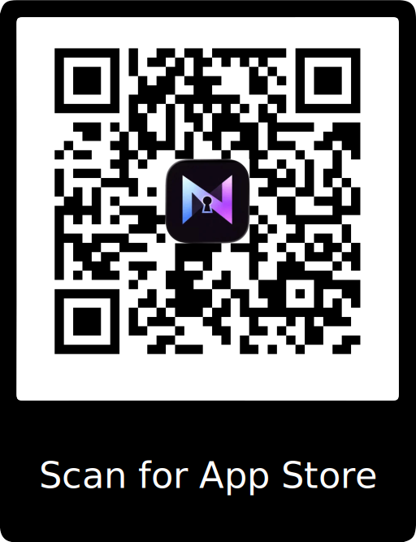

# Getting Started

## What you need
- An iPhone running the NovaKey iOS app
- A computer running NovaKey-Daemon
- A local network connection (or trusted remote connection)

## High-level flow
1. Install NovaKey-Daemon on your computer
2. Install NovaKey on your iPhone
3. Pair the phone with the computer
4. Add secrets on the phone
5. Send secrets securely when needed

NovaKey does not sync secrets via cloud services. All data remains local to your devices.  
  
This is the fastest path to “send a secret from iPhone → computer”.

## On the phone (quick tour)

### Main screen

### Add a secret

### Pair by scanning a QR

## Step 0 — Install NovaKey-Daemon

Follow: **NovaKey-Daemon → Install** and complete the installer for your platform.  
The daemon will start automatically after installation.

**If you want phone → computer over Wi-Fi:** the daemon must listen on a LAN-reachable address (not `127.0.0.1`).

<section class="nv-apps">
  <h2 class="nv-apps__title">Get the apps</h2>
  
Download the mobile apps

  

    <!-- Card 1 -->
    <article class="nv-apps__card">
      

        
      

      
NovaKey

      
iOS

    

      
    

    </article>
  

</section>

## Step 1 — Open NovaKey and add a Listener

1. Open **NovaKey**
2. Tap **Listeners** (antenna icon)
3. Add Listener:
   - Name: “My Desktop”
   - Host/IP: your computer’s LAN IP/hostname
   - Port: `60768`
4. Turn on **Make Send Target**
5. Tap **Add**

## Step 2 — Pair via QR

1. On your computer, start NovaKey-Daemon.
2. If there are no paired devices, the daemon enters pairing mode and generates a **time-limited pairing QR**.
3. On iOS:
   - Listeners → select your listener → Pair → Scan QR
4. Scan the QR.

You should see **Paired**.

If you miss the QR code, restart the daemon or see the NovaKey-Daemon troubleshooting guide.

## Step 3 — Add a secret

1. Tap **+**
2. Enter a label + secret + confirm
3. Tap **Save**

NovaKey will never display the secret again (by design).

## Step 4 — Send it

1. Tap the secret
2. Tap **Send**
3. Authenticate with Face ID / passcode

Success outcomes:
- ✅ **Sent to <Computer>** (typed injection)
- ✅ **📋 Copied to clipboard on <Computer>** (injection blocked; clipboard mode used)

## If something doesn’t work

Start with:
- **Phone App → Troubleshooting**
- **NovaKey-Daemon → Troubleshooting**

