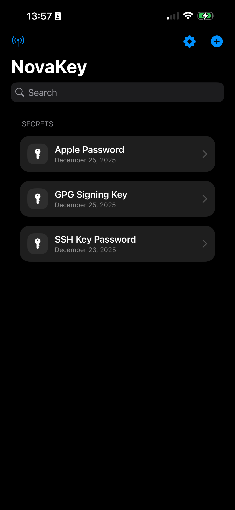
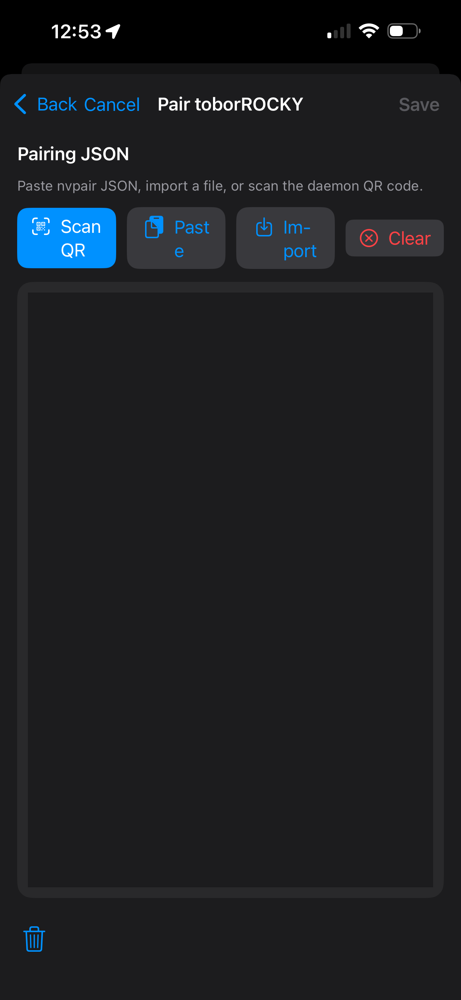

# Getting Started

This is the fastest path to “send a secret from iPhone → computer”.

## On the phone (quick tour)

### Main screen

### Add a secret

### Pair by scanning a QR

## Step 0 — Install NovaKey-Daemon

Follow: **NovaKey-Daemon → Install**

**If you want phone → computer over Wi-Fi:** the daemon must listen on a LAN-reachable address (not `127.0.0.1`).

## Step 1 — Open NovaKey and add a Listener

1. Open **NovaKey**
2. Tap **Listeners** (antenna icon)
3. Add Listener:
   - Name: “My Desktop”
   - Host/IP: your computer’s LAN IP/hostname
   - Port: `60768`
4. Turn on **Make Send Target**
5. Tap **Add**

## Step 2 — Pair via QR

1. On your computer, start NovaKey-Daemon.
2. If there are no paired devices, it will generate a pairing QR.
3. On iOS:
   - Listeners → select your listener → Pair → Scan QR
4. Scan the QR.

You should see **Paired**.

## Step 3 — Add a secret

1. Tap **+**
2. Enter a label + secret + confirm
3. Tap **Save**

NovaKey will never display the secret again (by design).

## Step 4 — Send it

1. Tap the secret
2. Tap **Send**
3. Authenticate with Face ID / passcode

Success outcomes:
- ✅ **Sent to <Computer>** (typed injection)
- ✅ **📋 Copied to clipboard on <Computer>** (injection blocked; clipboard fallback)

## If something doesn’t work

Start with:
- **Phone App → Troubleshooting**
- **NovaKey-Daemon → Troubleshooting**

