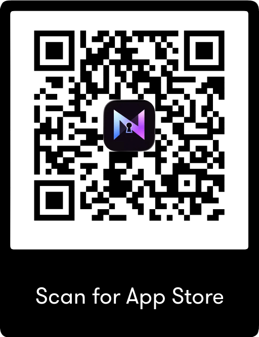

# NovaKey Apps

NovaKey is designed as a password manager for password managers (*e.g., Bitwarden, LastPass, KeePass, 1Pass, Keeper*)
In technical terms this is a secure secret delivery system designed to send sensitive data such as a password from your phone to a trusted computer **without exposing secrets on the screen**.  
  
NovaKey consists of:  
- **NovaKey Phone App** – stores secrets/passwords in a phones native vault with the ability to send them securely to a computer  
- **NovaKey-Daemon** – runs on the target computer and receives secrets from the phone  
  
[Download NovaKey-Daemon for your computer](https://github.com/OsbornePro/NovaKey-Daemon/releases/tag/v1.0.0)

### Download NovaKey from the App Store 

**Why should I trust NovaKey to not expose my passwords?**  
NovaKey is designed with:  
- Strong post-quantum cryptography  
- Minimal attack surface  
- Accessibility-first UI  
- Secrets live **only** on your phone (*iOS Keychain or KeyStore*).  
- Secrets are transmitted **on demand** to a trusted computer using mutual authentication, replay protection, and modern cryptography.  
- The computer runs **NovaKey-Daemon**, which injects into the currently focused field.
  (*and may fall back to clipboard in constrained environments*).  
- NovaKey does not inject new lines or submit button clicks by pressing [ENTER] for you  
- Secrets are never displayed after saving and are only transmitted to explicitly paired devices.  

# NovaKey Phone App

## Quick start

1. Install and run NovaKey-Daemon  
   → See **NovaKey-Daemon → [Install](https://novakey.app/en/latest/daemon/install/)**

2. Add a Listener in the NovaKey Phone app  
   → See **Phone App → [Pairing](https://novakey.app/en/latest/daemon/pairing/)**

3. Pair via QR  
   → See **Phone App → [Pairing](https://novakey.app/en/latest/phone/pairing/)**

4. Add secrets and send  
   → See **Phone App → [Secrets](https://novakey.app/en/latest/phone/secrets/)** and **Phone App → [Sending](https://novakey.app/en/latest/phone/sending/)**

## What NovaKey is (and isn’t)

**NovaKey is:**  
- A local-first, explicit “*send secret now*” tool.  
- Opinionated about safety: no silent fallbacks, no cloud dependency.  
  
**NovaKey is not:**
- A password manager UI that displays or updates secrets later.  
- A cloud sync service.  

## Architecture overview

### iOS App
- Stores secrets in the iOS Keychain or Android KeyStore
- Requires Face ID / passcode to copy or send
- Never displays secrets after saving

### NovaKey-Daemon
- Runs on your computer
- Accepts secrets only from paired devices
- Optional safety gates:
  - arming (*“push-to-type”*)
  - two-man approval (*approve then inject*)
  - target allow/deny policy
- Injects into the active application (*injects into the focused field; if injection is blocked and policy allows, the daemon may copy the secret to clipboard and report this explicitly*)

NovaKey is open source. See **[Project Links](https://novakey.app/en/latest/links/)** for repositories and source code.
