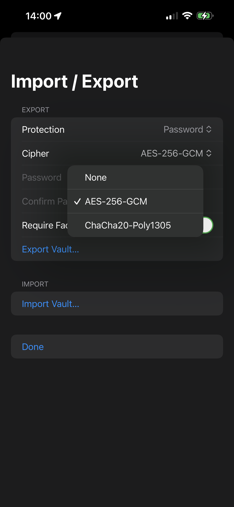
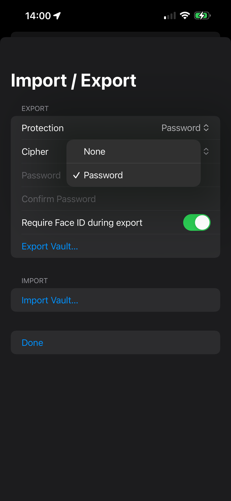

# Vault Import and Export

NovaKey supports **vault backups** as JSON files.  
Vaults may be exported with **no protection** or with **password-based encryption**.
NovaKey allows secure export and import of secrets for backup or migration.

## Export options
- Password-protected archive
- Biometric-protected archive

## Import behavior
- Imported secrets are validated before storage
- Existing secrets are not overwritten silently

Accessibility announcements confirm successful imports or errors.

> Treat vault files as sensitive. Even encrypted vaults should be stored carefully.

---

## Exporting a vault

1. Open **Settings**
2. Tap **Export Vault**
3. Choose:
   - **Protection:** **None** or **Password**
   - **Cipher:** **AES-256-GCM** or **ChaCha20-Poly1305**
4. *(Optional)* Require Face ID for each secret during export
5. Save the file

---

## Export screens

### Export options

### Export (password or none)

---

## Importing a vault

1. Open **Settings**
2. Tap **Import Vault**
3. Select a vault JSON file
4. Enter password if required

### Import behavior
- Existing secrets may be **updated**
- New secrets are **added**
- Keychain entries are overwritten securely for imported items

---

## Best practices

- Prefer **Password** protection for exports.
- Store vault backups in a secure location (encrypted disk, password manager file store, etc.).
- Avoid sharing vault files over insecure channels.
- If you suspect a vault file leaked, treat it like credential exposure:
  - rotate affected secrets
  - consider re-pairing devices

