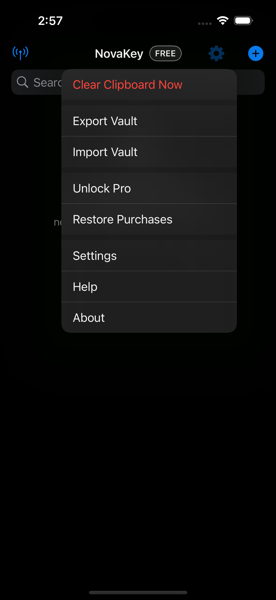
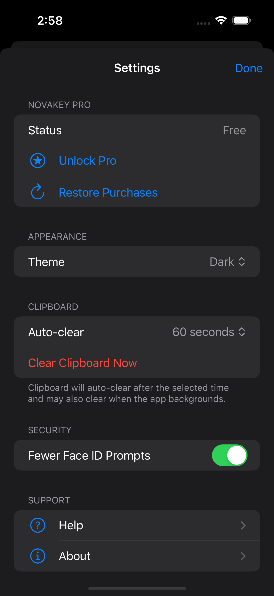

# NovaKey iOS App Overview

The NovaKey iOS app is responsible for:
- Storing secrets securely on-device
- Managing trusted listeners (computers)
- Sending secrets over an encrypted channel
- Providing accessibility-friendly interactions

## Free vs Pro
NovaKey offers a free tier and a one-time Pro unlock.

| Feature | Free | Pro |
|------|------|-----|
| Listeners | 1 | Unlimited |
| Secrets | 1 | Unlimited |
| Clipboard Copy (Phone) | Yes | Yes |
| Clipboard Injection (Computer) | Yes | Yes |
| Restore Purchases | N/A | Yes |

When a free-tier limit is reached, NovaKey shows a clear alert explaining the restriction and offering the Pro unlock.

NovaKey (iOS) acts as the secure vault and control surface:

- Secrets are stored **only on your phone** (iOS Keychain).
- Sending/copying requires **Face ID / passcode**.
- Secrets are never shown again after you tap **Save**.

## Screens

### Main screen

### Settings menu

### Settings page

## Main concepts

### Secrets
A secret is a labeled value you can copy locally or send to a paired computer.

### Listeners
A Listener is a saved “computer target” (name, host/IP, port). One Listener can be marked as the **Send Target**.

### Pairing
Pairing establishes mutual trust between the iOS app and NovaKey-Daemon. You typically do this once per computer/device.

## Where to go next
- Pairing: **Phone App → Pairing**
- Sending: **Phone App → Sending**
- Troubleshooting: **Phone App → Troubleshooting**

