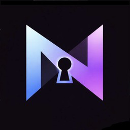
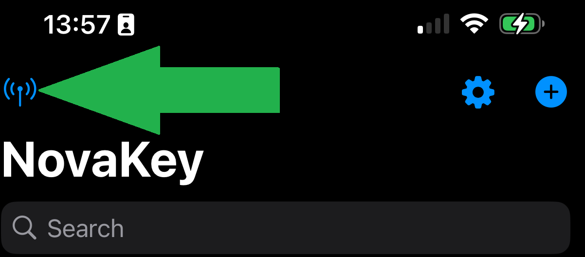
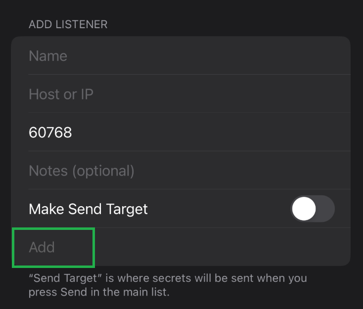
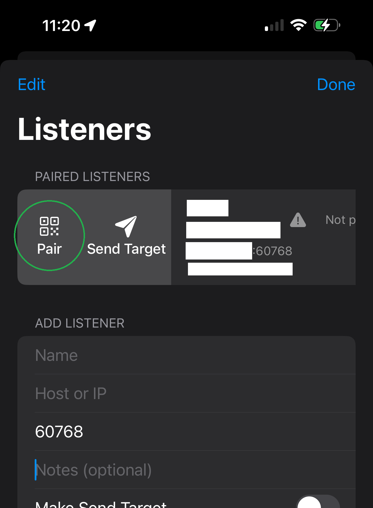
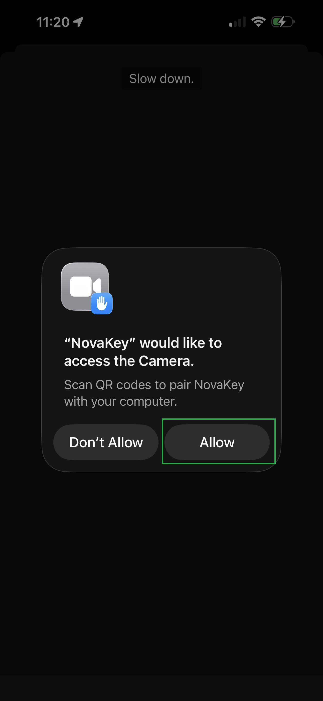
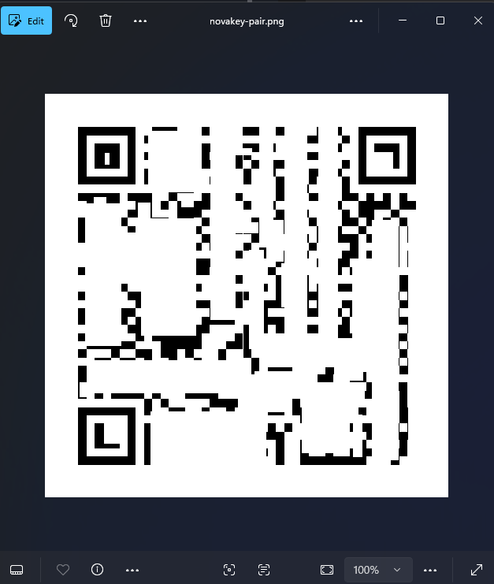
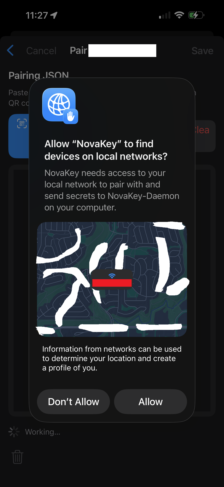

# Getting Started

This guide walks you through everything you need to do after purchasing the NovaKey Phone App (*iOS or Android*), from installing the desktop companion to sending your first secret.

---

## What you need

- An iPhone with the **NovaKey** app installed (*iOS or Android*)
- A computer running **NovaKey-Daemon** (*Windows, macOS, or Linux*)
- A local network connection (*same Wi-Fi for phone and computer*)

NovaKey does not use cloud services. All secrets remain local to your devices.

---

## High-level setup flow

1. Install NovaKey-Daemon on your computer
2. Open NovaKey on your Phone
3. Add a Listener in your Phone App (*listener is your computer receiving the secrets/passwords*)
4. Pair the phone and computer
5. Add a secret on your phone
6. Tap the Arm option then Send the secret securely when needed

This is the fastest path to "send a secret from iPhone → computer".

---

## On the phone (quick tour)

### Main screen


### Add a secret


### Pair by scanning a QR code


---

## Step 0 — Install NovaKey-Daemon on your computer

NovaKey-Daemon is the free desktop companion required to receive secrets from your phone.

### Download the daemon

NovaKey-Daemon is distributed via GitHub and the zip file can be downloaded from [HERE](https://github.com/OsbornePro/NovaKey-Daemon/archive/refs/heads/main.zip)

---

### Windows installation (*recommended path*)

1. Download the ZIP file from GitHub  
   (*Code → Download ZIP*)

2. Extract the ZIP file to a folder (for example: `Downloads\NovaKey-Daemon`)

3. Open **PowerShell** (*not Command Prompt*) usnig "Run As Administrator" if your user account and admin account are one in the same. This will allow setting the firewall rule for you. 

4. Allow local scripts to run (*current session*):
   ```powershell
   Set-ExecutionPolicy -Scope Process -ExecutionPolicy RemoteSigned
   ```
5. Unblock the installer script (*scripts downloaded from the internet are blocked by default*):

   ```powershell
   # Execute the below command from the root directory of the zip file directory you extracted to
   Unblock-File -Path .\Installers\install-windows.ps1
   ```

6. Run the installer:

   ```powershell
   .\Installers\install-windows.ps1
   ```

The installer will:

* Create a Schedueled Task that runs as you at machine starrtup
* Set up NovaKey-Daemon (*Can be viewed in your* `%LOCALAPPDATA%` *directory*)
* Configure firewall rules (*allow TCP port 60768*)
* Start the daemon (*run the schedueld task*)

---

### macOS installation

```bash
cd /tmp
git clone https://github.com/OsbornePro/NovaKey-Daemon.git
cd NovaKey-Daemon
sudo chmod +x Installers/install-macos.sh
sudo bash Installers/install-macos.sh
```

---

### Linux installation

```bash
cd /tmp
git clone https://github.com/OsbornePro/NovaKey-Daemon.git
cd NovaKey-Daemon
sudo chmod +x Installers/install-linux.sh
sudo bash Installers/install-linux.sh
```

---

### Verify the daemon is running

The daemon must be listening on port `60768`.

**Windows**

```powershell
Get-NetTcpConnection -State Listen -LocalPort 60768
```

**Linux**

```bash
ss -tunlp | grep 60768
```

**macOS**

```bash
lsof -i :60768
```

If the daemon is running and listening, you are ready to pair.

---

## Step 1 — Open NovaKey and add a Listener (Phone)

1. Open the **NovaKey** app
   

2. Tap **Listeners** (antenna icon)
   

3. Under **Add Listener**, enter:

   * **Name:** e.g. “My Desktop”
   * **Host or IP:** your computer’s LAN IP or hostname
   * **Port:** `60768`
   * *(Optional)* Notes

4. Enable **Make Send Target** (required)

5. Tap **Add**
   

> IMPORTANT: A Send Target must be selected to pair or send secrets.

---

## Step 2 — Pair the phone and computer (QR code)

### On your phone

1. Go to **Listeners**
2. Tap your listener or swipe right on it
3. Choose **Pair**
   
4. Tap **Scan QR Code** and keep this screen open
   
5. Allow camera access if prompted
   

---

### On your computer

1. Start NovaKey-Daemon (the installer usually starts it automatically)

2. If no devices are paired yet, the daemon will generate a QR code and open it
   

3. Scan the QR code with your phone

---

### Complete pairing

1. Verify the device information on your phone
2. Tap **Pair**
3. Allow local network access when prompted
   

When pairing is complete, the listener will show **Paired**.


---

## Step 3 — Add your first secret

1. Tap **+**
2. Enter a label and the secret
3. Confirm and tap **Save**

NovaKey intentionally does not display secrets again after saving.

---

## Step 4 — Send a secret

1. Tap the secret
2. Tap **Arm Computer (15s)**
3. Tap **Send**
4. Authenticate with Face ID or device passcode

Possible outcomes:

* **Sent to <Computer>** (typed injection)
* **📋 Copied to clipboard on <Computer>** (typing blocked, clipboard used)

---

## If something doesn’t work

Start with:

* **Phone App → Troubleshooting**
* **NovaKey-Daemon → Troubleshooting**

Most issues are caused by:

* Phone and computer not on the same network
* Firewall blocking port `60768`
* Daemon bound to `127.0.0.1` instead of a LAN address

---

You’re now ready to use NovaKey securely.
