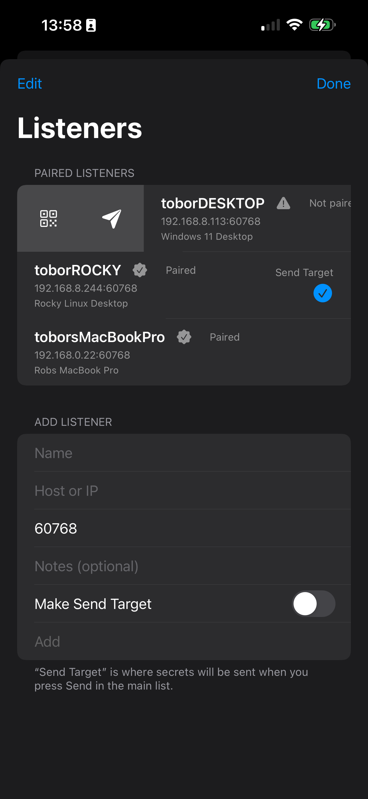

# Pairing a Computer

Pairing establishes **mutual trust** between your iPhone and your computer.  
You typically do this **once per computer**, and again if you reinstall the daemon, rotate keys, or change the listener host/port.

## Pairing methods
- Scan a QR code generated by NovaKey-Daemon
- Paste the pairing JSON manually

## What pairing does
- Establishes cryptographic trust
- Stores a device-specific key in the iOS Keychain
- Prevents replay or unauthorized injection

Pairing must be completed before secrets can be sent.

If pairing fails, NovaKey provides VoiceOver announcements and visible error feedback.

---

## Pairing screens

### Manage listeners

### Pair / Send actions on a listener

### Scan QR code

---

## Before you start

### 1) Confirm the daemon is running
NovaKey-Daemon must be installed and running on your computer.

### 2) Make sure the phone can reach the daemon
This is the most common setup issue:

- **Local-only (safe default):** daemon listens on `127.0.0.1:60768`  
  Your iPhone **cannot** reach loopback on your computer, so pairing/sending will fail from the phone.

- **LAN / Wi-Fi:** daemon listens on `0.0.0.0:60768` *or* your computer’s LAN IP  
  Your iPhone **can** reach it while on the same network.

If you want phone → computer over Wi-Fi, the daemon must bind to a LAN-reachable address and your firewall must allow the port.

---

## Step 1 — Add a Listener (iOS)

1. Open **NovaKey**
2. Tap **Listeners** (antenna icon)
3. Under **Add Listener** enter:
   - **Name:** e.g. “Linux Desktop”
   - **Host or IP:** your computer’s hostname or LAN IP
   - **Port:** `60768` (default)
   - *(Optional)* Notes
4. Enable **Make Send Target** if this is your main computer
5. Tap **Add**

> You must have a **Send Target** selected to pair or send.

---

## Step 2 — Pair via QR (recommended)

1. On your computer: start NovaKey-Daemon.
2. If there are **no paired devices yet**, the daemon generates a pairing QR code (often `novakey-pair.png`).
   - If a device store already exists, the daemon may not generate a new pairing QR automatically.
   - If you need a new QR, you may need to delete/reset the device store or explicitly trigger pairing mode (depends on your daemon build/config).
3. On your iPhone:
   - **Listeners** → tap your listener
   - Choose **Pair**
   - Tap **Scan QR Code**
4. Scan the QR shown on the computer.

During pairing, NovaKey will:
- verify the server identity (fingerprint)
- establish post-quantum session keys
- store pairing keys in the iOS Keychain
- finalize pairing with the daemon

You’ll see **“Paired”** when complete.

---

## Step 3 — Manual pairing (advanced)

Use this if you **cannot scan** the QR code.

1. On your computer, locate the pairing output (the daemon’s pairing blob / pairing JSON produced during pairing).
2. On your iPhone:
   - **Listeners** → tap your listener → **Pair**
   - Paste the pairing JSON/blob into the editor
   - Tap **Save**

⚠️ Treat pairing material as **highly sensitive**. Anyone with it may be able to impersonate your device.

---

## Common pairing failures (quick fixes)

### “Not paired”
- Re-pair the listener (Pair → Scan QR Code)
- If the daemon rotated keys or the device store was reset, you must re-pair

### “No Send Target set”
- Go to **Listeners**
- Edit/select the listener and enable **Make Send Target**

### Can’t connect / times out
- Ensure the daemon is bound to a LAN address (not `127.0.0.1`)
- Verify your computer firewall allows inbound TCP `60768`
- Confirm phone and computer are on the same Wi-Fi/LAN
- Try using the computer’s LAN IP instead of hostname

### Pairing works, but sending fails later
- Check daemon is **armed** (if arming is enabled)
- If **Two-Man Mode** is enabled, approve on the computer before injection

---

## Delete a listener

---

## Why host/IP can’t be edited after pairing

Pairing keys are bound to a **specific server address** to prevent silent redirection attacks.

If the server address changes:
- create a **new Listener**
- re-pair

You can still edit:
- display name
- notes

