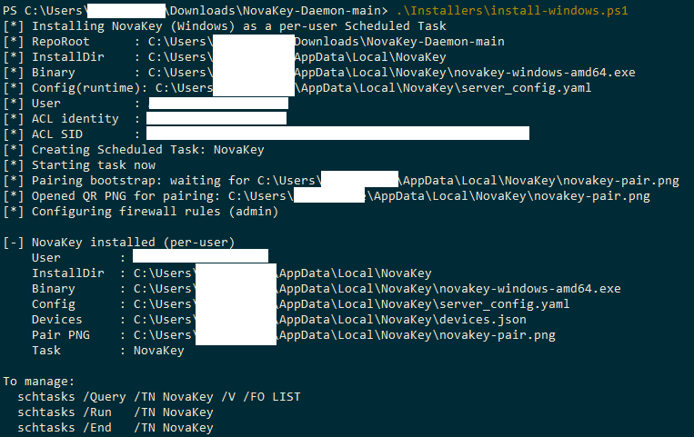
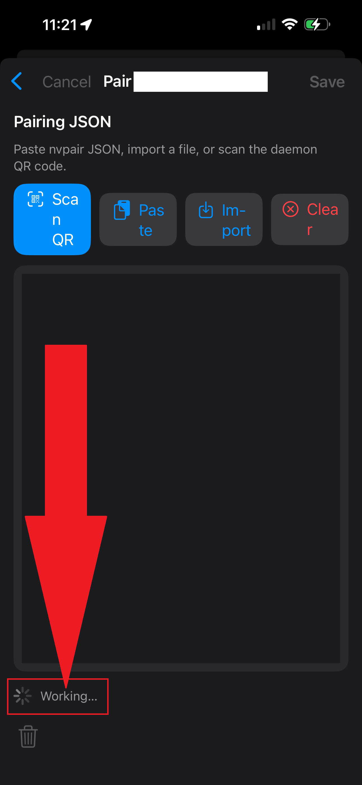
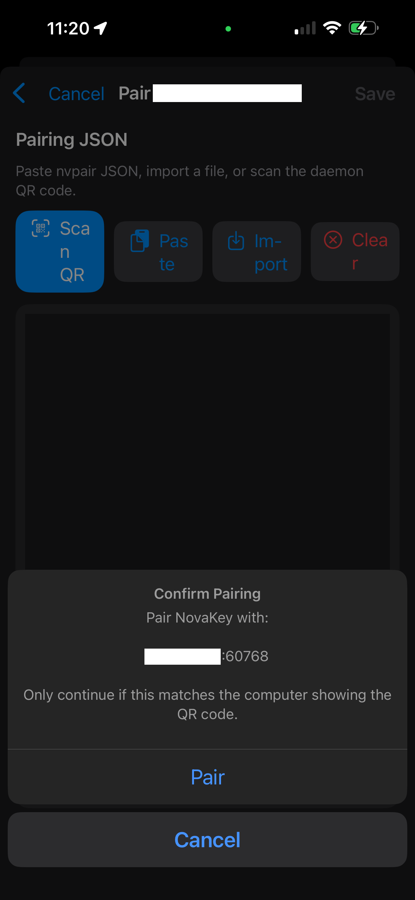

# Pairing a Computer

Pairing connects your iPhone and computer so they can trust each other and communicate securely.

You only need to pair **once per computer**. Pair again if you reinstall NovaKey-Daemon, reset pairing data, rotate keys, or change the listener’s host or port.

After pairing:
- Your phone and computer recognize each other
- All communication is encrypted and authenticated
- Secrets can be sent securely on demand

No cloud services or accounts are involved.

---

## Important note for free NovaKey users

**NOTE:** When using the free NovaKey app, complete device pairing before leaving the “Add Listener” screen. You may minimize the NovaKey app or switch to other apps during this process; however, saving the listener without completing pairing will lock the configuration. If this occurs, the app must be reinstalled to recover.

---

## Pairing methods

You can pair a computer using one of the following methods:
- Scan a QR code generated by NovaKey-Daemon (*recommended*)
- Paste the pairing JSON manually (*possible to do for future functionality but not made user friendly by design*)

---

## What pairing does

Pairing:
- Establishes trust between your phone and computer
- Stores a device-specific key securely in your phones key vault (*Example the iOS Keychain*)
- Ensures only paired devices can communicate
- Prevents unauthorized or replayed requests

Pairing must be completed before secrets can be sent.

If pairing fails, NovaKey shows visible error messages and provides VoiceOver announcements when accessibility options are enabled.

---

## Before you start

### 1) Confirm NovaKey-Daemon is running

NovaKey-Daemon must be installed and running on your computer.

If you have not installed it yet, follow the install instructions here:  
https://novakey.app/en/latest/

---

### 2) Make sure your phone can reach the daemon

This is the most common setup issue.

Your phone must be on the **same network (same Wi-Fi)** as your computer and be able to reach it on TCP port **60768**.

Important notes:
- If the daemon listens on `127.0.0.1`, your phone cannot connect
- The daemon must listen on a LAN-reachable address such as `0.0.0.0` or your computer’s local IP
- Your computer’s firewall must allow inbound TCP traffic on port 60768

Valid local IP addresses usually start with:
- `192.x.x.x`
- `172.x.x.x`
- `10.x.x.x`

Do not use `127.x.x.x`.

---

## Step 1 — Add a Listener (Phone)

1. Open the **NovaKey** app  
   
2. Tap **Listeners** (antenna icon)  
   
3. Under **Add Listener**, enter:
   - **Name:** for example, “Linux Desktop”
   - **Host or IP:** your computer’s hostname or LAN IP
   - **Port:** `60768`
   - *(Optional)* Notes
4. Enable **Make Send Target** (required for pairing)
5. Tap **Add**  
   

> **IMPORTANT:** A Send Target must be selected to pair or send secrets.

---

## Step 2 — Pair via QR code (recommended)

### On your phone

1. Go to **Listeners**
2. Tap your listener or swipe right on it
3. Choose **Pair**  
   
4. Tap **Scan QR Code** and keep this screen open  
   
5. If prompted, allow camera access (used only to scan the QR code)  
   

---

### On your computer

1. Run the NovaKey-Daemon install script for your operating system  
   
2. If no devices are paired yet, the daemon generates a pairing QR code and opens it automatically  
   

If a device store already exists, a new QR code will not be generated automatically.  
If needed, uninstall and reinstall the daemon to reset pairing. This does not affect secrets stored on your phone.

---

### Complete pairing

1. Scan the QR code with your phone  
   
2. Verify the device information and tap **Pair**  
   
3. When prompted, allow local network access  
   

When pairing is complete, the listener will show **Paired**.  

---

## What happens during pairing (advanced)

During pairing, NovaKey:
- Verifies the computer’s identity
- Establishes encrypted session keys
- Stores pairing keys securely on both devices
- Finalizes trust between the phone and daemon

Treat pairing material as sensitive. An attacker who gains access to your phone or to the computer's secure key storage could potentially impersonate a paired device.

---

## Common pairing failures

### "Not paired"
- Re-pair using **Pair → Scan QR Code**. To do this fresh, select the listener and tap the trash can icon in the bottom-left corner of your phone's screen. This removes the existing pairing keys for that computer from your phone.
- Re-pair if the daemon was reinstalled or reset by running the install script for the NovaKey-Daemon

### "No Send Target set"
- Go to **Listeners**
- Enable **Make Send Target** by tapping the listener you wish to receive

### Can't connect or times out
- Ensure the daemon is not bound to `127.0.0.1`
- Verify port `60768` is allowed through the firewall
- Confirm both devices are on the same network
- Try using the computer’s LAN IP instead of hostname

### Pairing works, but sending fails later
- Ensure the daemon is armed (*if arming is enabled*). Tap a secret and select "Arm 15s". Tap your secret and select "Send"  
  
  You will see this message if successful:
  
- If Two-Man Mode is enabled, you may need to approve the request on the computer though this should handle itself automatically
- Tap your secret and select "Send"  
  
  You will see a successful send message  
  

---

## Delete a listener

Swipe left on the listener to delete it.  

---

## Why the host or IP cannot be edited after pairing

Pairing keys are bound to a specific server address to prevent silent redirection attacks.

If the server address changes:
- Create a new listener
- Pair again

You can still edit:
- Display name
- Notes
