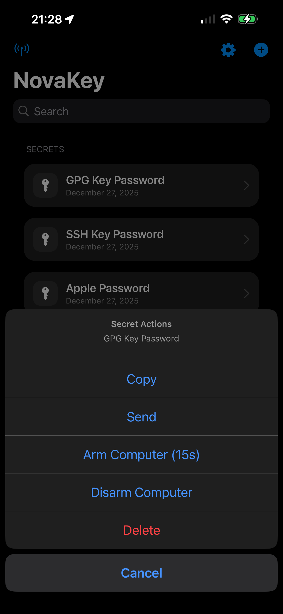

# Secrets

Secrets are pieces of sensitive data such as:
- Passwords
- API keys
- Recovery Tokens

## Security model
- Secrets are never shown after saving
- Secrets are stored in the iOS Keychain
- Secrets require biometric or device authentication to access

## Free tier limits
- Free users may store **1 secret**
- Attempting to add a second secret triggers a limit alert

Pro users may store unlimited secrets.

## Adding and Managing Secrets

### Create a new secret

## Add a secret
1. Tap **+**
2. Enter:
   - **Label** (example: “Email Password”)
   - **Secret**
   - **Confirm Secret**
3. Tap **Save**

### Secret actions

## Important behavior (by design)
- Secrets are **never displayed again** after saving.
- Secrets live only in the **iOS Keychain**.
- Access requires **Face ID / passcode** when copying or sending.

## Delete a secret
- Swipe to delete, or use the secret’s action menu.

Deleting removes:
- the app record
- the Keychain entry

## Clipboard access
Secrets can only be copied to the clipboard in the Pro tier.

This prevents secrets from being accidentally exposed through system pasteboards in the Free tier.

