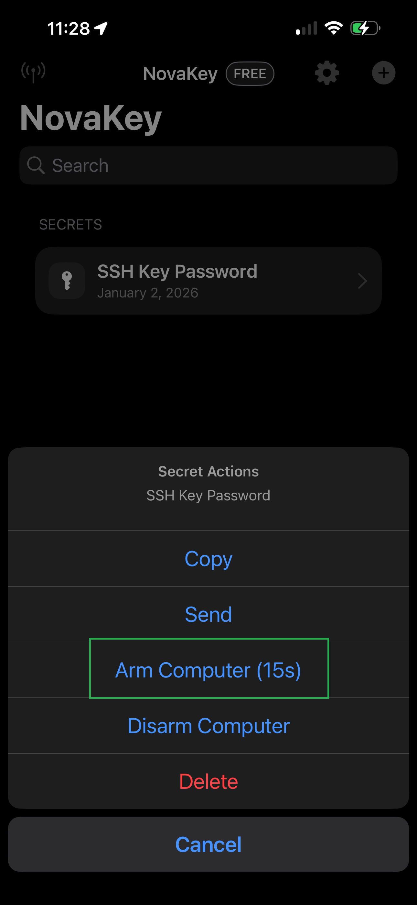
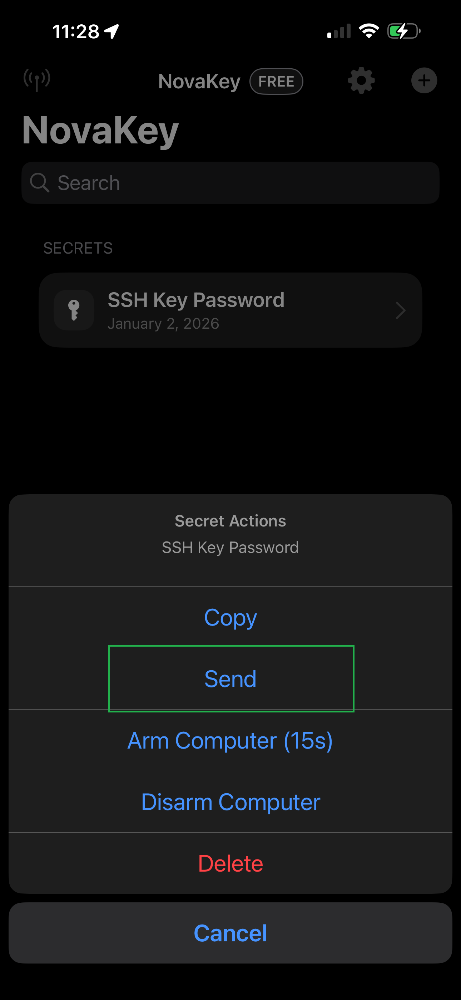
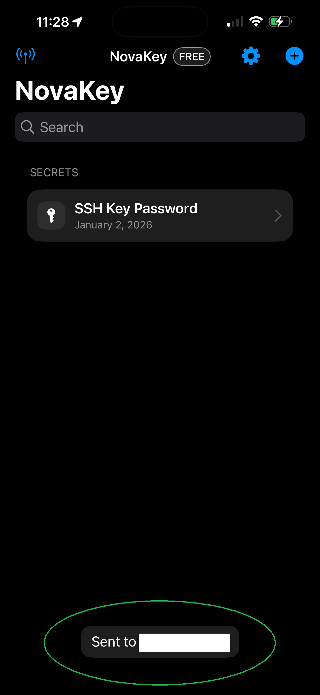

# Sending Secrets

You can send a secret to a paired computer whenever it is needed.

---

## Basic sending flow

1. Select a secret
2. Tap **Arm Computer (15s)**  

3. If successfuly you will see this:  

4. Tap **Send**  

6. Authenticate with Face ID or device passcode
7. NovaKey securely delivers the secret to the computer
8. When successful you will see this:  

The desktop daemon then injects or consumes the secret according to its configuration.

NovaKey provides both visual feedback and VoiceOver announcements for success or failure.

---

## What “arming” means

Arming tells the computer that it should expect a secret shortly.  
For safety reasons, the computer only accepts secrets for a short time window (*15 seconds by default*).

If the computer is not armed, sending is blocked.

---

## Send a secret (step by step)

1. Tap the secret you want to send
2. Tap **Arm Computer (15s)**  
   This notifies the paired computer that input is coming
3. Tap **Send**
4. Confirm the biometric or passcode prompt
5. Watch for a result message:
   - **Sent to <Computer>**
   - or **📋 Copied to clipboard on <Computer>** (*when injection is blocked*)

> If no Send Target is selected, sending is blocked.
> If you armed the computer and received a message it was not armed, restart the novakey service and try again.

---

## How sending works (*behind the scenes*)

When you tap **Send**, NovaKey:
1. Authenticates you using Face ID or passcode
2. Verifies the device pairing
3. Optionally waits for approval on the computer (*Two-Man Mode*)
4. Sends the secret to NovaKey-Daemon over an encrypted connection

---

## Two-Man Mode (*approval*)

Some configurations require an explicit approval step on the computer before injection is allowed.

Typical flow:
- The iOS app sends a request
- The daemon opens a short approval window on the computer
- After approval, the iOS app sends the secret
- The daemon injects it into the focused field

If approval is required but not granted, NovaKey displays a "Needs approval" error.

---

## Clipboard delivery

On some systems, or when injection is restricted by policy, NovaKey-Daemon may deliver the secret by copying it to the clipboard instead of typing it.

This behavior is available in both Free and Pro tiers.

When this happens:
- The send is treated as successful
- NovaKey clearly indicates clipboard delivery, for example:
  - **📋 Copied to clipboard on <Computer>**
- Any additional message from the daemon is shown when available

