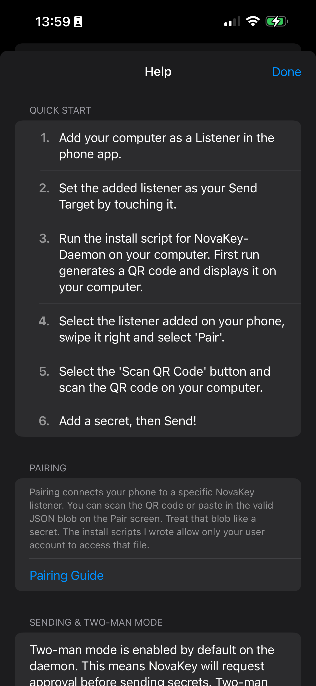

# Phone App Troubleshooting

This page covers common issues when using the **NovaKey iOS app** and how to resolve them quickly.

## Cannot add more secrets or listeners
You are likely using the Free tier.

NovaKey will:
- Show a clear alert explaining the limit
- Offer the Pro unlock
- Continue functioning normally otherwise

## Pairing issues
- Ensure daemon is running
- Ensure network connectivity
- Re-pair if cryptographic validation fails

All critical errors are announced via VoiceOver when enabled.
If something feels “*locked down*”, that is usually intentional for safety.

---

## In-app help & about

These screens are available from the app menu and often answer common questions:

### Help

### About

---

## Common issues

### “No Send Target set”

**What it means:**  
You haven’t selected a default computer to send secrets to.

**Fix:**
1. Open **Listeners**
2. Select a listener
3. Enable **Make Send Target**

You must have a Send Target to pair or send.

---

### “Not paired”

**What it means:**  
Your phone does not currently trust the target computer.

**Fix:**
- Open **Listeners**
- Select the listener
- Tap **Pair** and complete pairing again

Re-pairing is required if:
- the daemon was reinstalled
- pairing keys were rotated
- the device store was reset

---

### “Computer isn’t armed” / “Not armed”

**What it means:**  
The daemon has **arming (“push-to-type”) enabled**, and injection is blocked until it is armed locally.

**Fix:**
- Arm NovaKey-Daemon on the computer
- Then retry sending from the phone

This is a safety feature to prevent unattended injection.

---

### “Needs approval”

**What it means:**  
**Two-Man Mode** is enabled on the daemon. Injection requires an explicit approval before it is allowed.

**Fix:**
- Approve on the computer
- Then send again from the phone  
  *(or enable auto-approve in the app, if appropriate)*

Approvals are time-limited.

---

### “Copied to clipboard on computer”

**What it means:**  
The daemon could not type into the active field, but **successfully copied the secret to the computer’s clipboard**.

This is treated as a **successful send**, but is visually differentiated.

**Common causes:**
- OS injection permissions missing (macOS accessibility)
- Wayland / compositor restrictions (Linux)
- Secure input mode enabled by the focused app
- Target policy denying the focused app/window

**What to do next:**
- Paste manually on the computer
- Review **NovaKey-Daemon → Troubleshooting** if this happens unexpectedly

---

### “Clock check failed” / timestamp errors

**What it means:**  
NovaKey rejected a message due to freshness or replay protection.

**Fix:**
- Ensure both phone and computer have correct system time
- Enable automatic time synchronization on both devices

---

## If nothing seems to work

Collect the following before digging deeper:

- Listener **host** and **port**
- Whether the daemon is bound to **loopback** (`127.0.0.1`) or **LAN**
- Whether the daemon is **armed**
- Whether **Two-Man Mode** is enabled
- The exact error message shown in the app
- Relevant daemon logs (treat logs as sensitive)

Then check:
- **NovaKey-Daemon → Troubleshooting**
- **FAQ**

If you’re still stuck, re-pairing is often the fastest reset.

